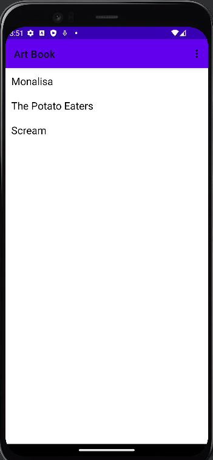
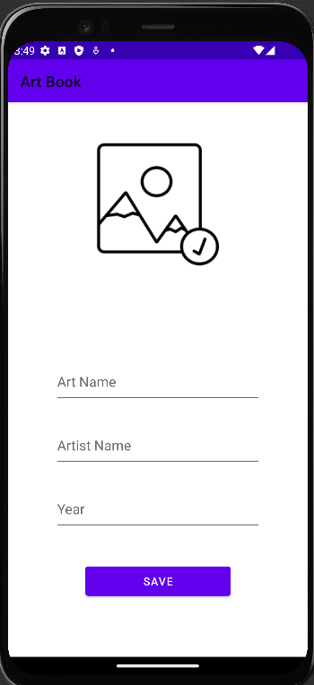
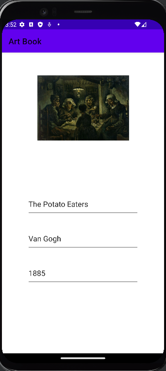

# Art Book App

Art Book is a simple Android application that allows you to store and view your favorite artworks. With this app, you can easily add details about your artworks, including the image path, artist's name, and the date of creation. It uses SQLite to store your data securely on your device.

## Screenshots

