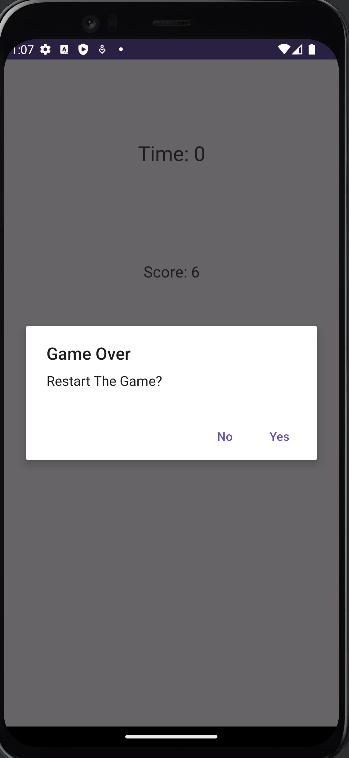

# Calculator App

This is a calculator app developed using Kotlin programming language. This application can perform basic mathematical operations: addition, subtraction, multiplication, and division.

## Screenshots

